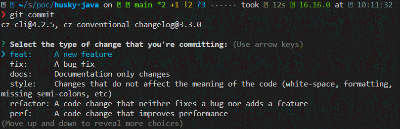
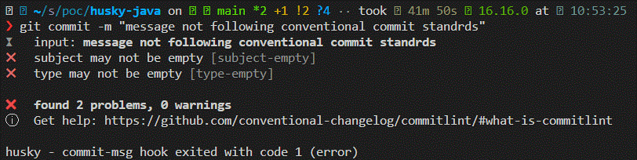
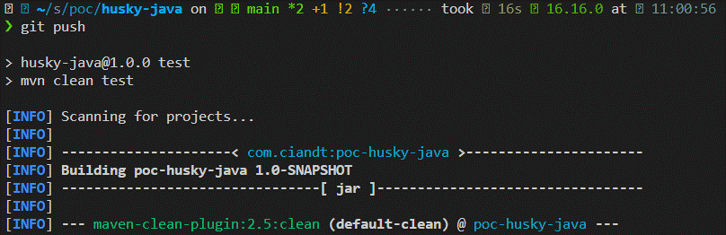

# Welcome to husky-java 
[](#)
[](#)
[](#)
[](#)
[](https://conventionalcommits.org)

> Proof of Concept of using Husky in a Java project with Maven

## Install

```sh
npm install
```

## Usage

### Commitzen

In order to use Commitzen to aid you write your commits following the [Conventional Commit Standards](https://www.conventionalcommits.org/en/v1.0.0/#summary) you just need type:
```sh
git commit
```

The following selection options will appear on CLI and you just need to follow the steps


### CommitLint

In case you already know the [Conventional Commit Standards](https://www.conventionalcommits.org/en/v1.0.0/#summary), just write your commit, when you finish it, husky will run CommitLint in your commit to check if it is following the standads.

```sh
git commit -m "message not following conventional commit standrds"
```



### Other Checks

It is possible to configure several other hooks.

In this project there is only a git push hook besides the commit check that will run build and tests of java project.

```
git push
```



## Run tests

```sh
npm run test
```

## Author

👤 **Bruno Habermann**

* Github: [@bhabermann](https://github.com/bhabermann)
* LinkedIn: [@brunohabermann](https://linkedin.com/in/brunohabermann)

## Show your support

Give a ⭐️ if this project helped you!


***
_This README was generated with ❤️ by [readme-md-generator](https://github.com/kefranabg/readme-md-generator)_